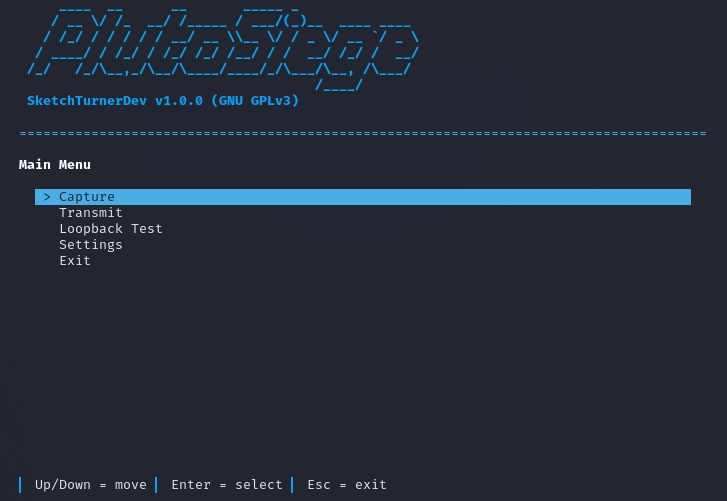

<h1 align="center">PlutoSiege</h1>

<p align="center">
  <strong>ISM-Band RF Capture & Replay Tool for PlutoSDR</strong>
</p>

<p align="center">
  
  
  
  
  
</p>

<p align="center">
  
</p>

> **REGULATORY DISCLAIMER**  
> RF transmission is regulated by local authorities. Replay only signals you own or are permitted to transmit, into a dummy load or at the lowest power required.

## About

**PlutoSiege** is a terminal application (TUI) for recording and replaying short ISM-band RF bursts (e.g. 433 MHz, 868 MHz) from car remotes, garage doors, doorbells, and wireless sensors.

Built for the **ADALM-Pluto (AD9363/AD9361)** SDR architecture, it saves recordings in standard **SigMF (Signal Metadata Format)** so they can be opened in other SDR tools like URH, IQEngine, GNU Radio, or Inspectrum.

### Hardware Compatibility
Fully supports both official **Analog Devices ADALM-Pluto** hardware (Rev. B / Rev. C) and third-party clones/analogues based on the same AD9363/AD9361 transceivers (such as **Pluto Nano**, **Pluto Plus**, and other custom PlutoSDR boards).

## Features

- **Level Metering**: Real-time dBFS level meter with saturation (`SAT!`) warning.
- **Threshold Detection**: Automated noise floor estimation or manual threshold setting.
- **Pre-Trigger Buffer**: Keeps a ring buffer of history before trigger so preambles are not missed.
- **SigMF Format**: Saves `.sigmf-meta` and `.sigmf-data` pairs.
- **Digital Loopback Test**: Built-in test screen to check hardware loopback and SNR.
- **Cross-Platform**: Runs on Linux, macOS, and Windows.

## Installation

### 1. System Driver Setup
- **Linux (Kali / Ubuntu / Debian)**: Install required IIO system drivers:
  ```bash
  sudo apt update && sudo apt install -y libiio0 libiio-dev libiio-utils
  ```
- **Windows (10 / 11)**:
  1. Install [libiio-setup.exe](https://github.com/analogdevicesinc/libiio/releases) C-library runtime.
  2. Install [PlutoSDR-M2k-USB-Drivers.exe](https://github.com/analogdevicesinc/plutosdr-m2k-drivers-win/releases) USB RNDIS driver.

### 2. Python Package & Setup
Clone repository and install dependencies:
```bash
git clone https://github.com/SketchTurnerDev/pluto_siege.git
cd pluto_siege
pip install -r requirements.txt
```

## Quick Start

Launch via main script:
```bash
python pluto_siege.py
```

Or run as a package:
```bash
python -m pluto_siege
```

Or install in editable mode:
```bash
pip install -e .
pluto_siege
```

## Configuration Parameters

Settings can be edited in the TUI **Settings** screen and are saved to `settings.json`.

| Parameter | Type | Default | Description |
| :--- | :--- | :--- | :--- |
| `pluto_uri` | `str` | `ip:192.168.2.1` | Pluto connection URI (`ip:192.168.2.1` or `usb:`). |
| `permit_out_of_spec_frequency` | `bool` | `false` | Allows tuning outside 325 MHz – 3.8 GHz range (up to 70 MHz – 6.0 GHz). |
| `rx_freq` | `int` | `433920000` | Receiver center frequency in Hz. |
| `tx_freq` | `int` | `433920000` | Transmitter center frequency in Hz. |
| `sample_rate` | `int` | `2100000` | Sample rate in Hz (521 kSPS – 61.44 MSPS). |
| `rx_gain` | `float` | `15.0` | Manual RX hardware gain in dB (0.0 to 74.5 dB). |
| `tx_gain` | `float` | `0.0` | Manual TX attenuation gain in dB (-89.75 to 0.0 dB). |
| `rx_buffer_size` | `int` | `32768` | DMA buffer size in samples (1024 to 32768). |
| `pre_trigger_buffers` | `int` | `2` | Number of pre-trigger buffers kept in memory. |
| `silence_seconds` | `float` | `0.80` | Silence required to stop recording. |
| `max_post_trigger_seconds` | `float` | `4.00` | Maximum recording length after trigger. |
| `auto_threshold` | `bool` | `true` | Automated noise floor calculation. |
| `auto_trigger_margin` | `float` | `8.0` | Margin in dB above noise floor required to trigger capture (1.0 to 30.0 dB). |
| `manual_threshold` | `float` | `-30.0` | Fixed trigger threshold in dBFS when auto is off. |

## License

Distributed under the **GNU General Public License v3.0** (GPL-3.0). See [`LICENSE`](LICENSE) for details.
